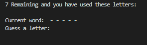
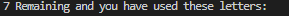
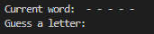
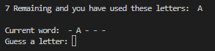
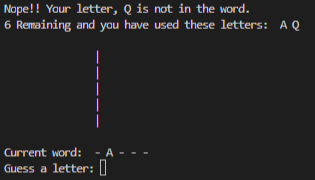

# Hangman

Hangman is a site that allows users to play a simple game of Hangman. The site will be targeted toward everyone who is looking for a way to play a simple game.

## Features 

## Existing Features

### Lives

The users have 7 lives, this means the users will have 7 opportunities to pick the correct letter. If chosen wrong the lives will decrease.

### Word Display

The user will be able to see the length of the word their trying to guess.

### Guess Correct 

When the user guesses a correct letter it then will display on the dotted line and the letters that the user used is also displayed.

### Guess Wrong

When the user guesses a wrong letter it then will display the start of the frame and the letters that the user used is also displayed. The frame will then progress when the user gusses more wrong letters.

## Testing

I spent nearly a week trying to get the Heroku app working but was unable, [Tutorial video](https://learn.codeinstitute.net/courses/course-v1:CodeInstitute+LS101+2021_T1/courseware/293ee9d8ff3542d3b877137ed81b9a5b/e3b664e16366444c8d722c5d8340b340/) and information below the video was followed but the app still would not work.

## Deployment

Deployment was very tricky and was not completed. The Heroku app was made, [Tutorial video](https://learn.codeinstitute.net/courses/course-v1:CodeInstitute+LS101+2021_T1/courseware/293ee9d8ff3542d3b877137ed81b9a5b/e3b664e16366444c8d722c5d8340b340/) and information below the video was followed but the app still would not work.

## Credits 

[W3Schools](https://www.w3schools.com/python/default.asp) helped me with the majority of the python code.

## Content
* Instructions on the making of the game was taken from [W3Schools](https://www.w3schools.com/python/default.asp)
* Font was taken from [Google Fonts](https://fonts.google.com/)